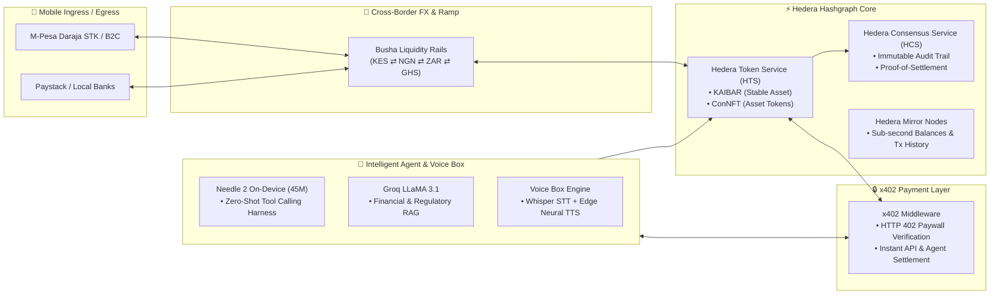

# 🌍 KAI Nuvari: M-Pesa × x402 × Hedera × Busha Cross-Border Rails

[](https://hedera.com/)
[](https://developer.safaricom.co.ke/)
[](https://x402.org)
[](https://busha.co/)
[](https://nextjs.org/)
[](https://fastapi.tiangolo.com/)

**KAI Nuvari** is a decentralized, AI-orchestrated cross-border settlement infrastructure bridging African mobile money (**M-Pesa**), regional crypto liquidity (**Busha**), sub-second distributed ledgers (**Hedera Hashgraph**), and web-native micro-payment protocols (**x402**).

---

## 🚀 Architecture & Flow Overview



---

## ✨ Core Pillars

### 1. 📱 M-Pesa & Mobile Money Rails
- **Instant Fiat Ingress:** Trigger seamless C2B payments via Safaricom Daraja STK Push directly from the web/mobile app.
- **Automated Payouts (B2C):** Settle directly back into user mobile money wallets (M-Pesa, Airtel Money, local bank accounts).
- **Webhooks & Status Reconciliation:** Real-time callback processing for instant cryptographic credit on Hedera.

### 2. 💱 Busha Cross-Border Liquidity Engine
- **Pan-African Multi-Currency Corridors:** Bridges fiat liquidity across Kenya (KES), Nigeria (NGN), South Africa (ZAR), and Ghana (GHS).
- **Frictionless On/Off-Ramp:** Instant conversion between local mobile fiat and digital assets with guaranteed rate locking.

### 3. ⚡ Hedera Hashgraph Settlement
- **Hedera Token Service (HTS):** Native tokenization of **KAIBAR** (stable transactional token) and **ConNFT** (fractional real-world asset & conservation tokens) without smart contract gas overhead.
- **Hedera Consensus Service (HCS):** Every cross-border transaction, FX conversion, and AI agent dispatch logs an immutable timestamped record to HCS audit topics.
- **Mirror Node Queries:** High-speed REST queries to Hedera Mirror Nodes for sub-second balances and transaction history.

### 4. 🔒 x402 Micro-Payment Protocol
- **Web-Native Monetization:** Implements the `402 Payment Required` standard via `@x402/core`, `@x402/evm`, and `@x402/fetch`.
- **Machine-to-Machine Settlement:** Allows autonomous AI agents, streaming APIs, and cross-border remittance bots to pay per call in micro-fractions of a cent.

### 5. 🤖 Autonomous AI Agent & Voice Engine
- **Needle 2 On-Device Tool Harness:** 45M parameter lightweight model executing deterministic Hedera & x402 tool-calling in a single forward pass without cloud latency.
- **Voice Box:** Complete bi-directional speech interface powered by Groq Whisper STT and Edge Neural TTS streaming.

---

## 📂 Repository Structure

```
├── agents/                     # AI Agent Harness & Rails
│   ├── hedera_rails.py         # Hedera HTS/HCS operations & Mirror Node client
│   ├── needle_harness.py       # Needle 2 on-device tool dispatch harness
│   ├── voice_agent.py          # Groq Whisper STT + Edge Neural TTS engine
│   ├── x402_rails.py           # x402 payment pricing and verification rails
│   └── x402_payer.py           # Machine-to-machine x402 client
├── contracts/                  # Solidity smart contracts (Hardhat)
├── frontend/                   # Next.js 16 Web & Mobile Terminal
│   ├── src/app/                # Next.js App Router (Dashboard, Pools, Swap, CFA, AI, Hub)
│   ├── src/app/api/mpesa/      # M-Pesa STK push, B2C, query, and callback APIs
│   ├── src/app/api/hedera/     # Hedera backend bridge routes
│   ├── src/components/voice/   # Voice Assistant UI components
│   ├── src/hooks/              # Custom hooks (useVoiceChat, useBalances, etc.)
│   └── src/lib/                # Hedera, HashConnect, x402, and Wagmi SDK clients
├── scripts/hedera/             # Hedera deployment & minting scripts
│   ├── create-hcs-topic.ts     # HCS audit topic provisioning
│   ├── create-kaibar-token.ts  # KAIBAR HTS token creator
│   └── deploy-nft-collections.ts
├── server.py                   # FastAPI Unified Backend & RAG Server
├── vector.py                   # ChromaDB vector knowledge base
├── start.ps1                   # One-click Windows / PowerShell launcher
└── requirements.txt            # Python dependencies
```

---

## 🛠️ Quick Start

### 1. Prerequisites
- **Node.js**: v18.0.0+
- **Python**: 3.10+
- **Package Managers**: `npm` and `pip`

### 2. Environment Configuration
Copy `.env.example` to `.env` in the root directory and `.env.local` in `frontend/`:

```bash
cp .env.example .env
```

Fill in your configuration keys:
```env
# Hedera Network
HEDERA_NETWORK=testnet
HEDERA_OPERATOR_ID=0.0.xxxxx
HEDERA_OPERATOR_KEY=302e...
KAIBAR_TOKEN_ID=0.0.xxxxx
HCS_AUDIT_TOPIC_ID=0.0.xxxxx

# M-Pesa Daraja API
MPESA_CONSUMER_KEY=your_daraja_consumer_key
MPESA_CONSUMER_SECRET=your_daraja_consumer_secret
MPESA_SHORTCODE=174379
MPESA_PASSKEY=your_daraja_passkey

# AI & Voice
GROQ_API_KEY=your_groq_api_key
VOICE_NAME=en-US-AvaMultilingualNeural
```

---

### 3. Run the Application

#### Option A: One-Click Launcher (PowerShell)
```powershell
.\start.ps1
```

#### Option B: Manual Startup

**Terminal 1 (AI Backend & Voice Server):**
```powershell
.\.venv\Scripts\python.exe -m uvicorn server:app --host 127.0.0.1 --port 8000 --reload
```

**Terminal 2 (Next.js Frontend):**
```powershell
cd frontend
npm run dev
```

---

## 🌐 Endpoints & UI Routes

| Service | URL | Description |
| :--- | :--- | :--- |
| **Frontend Web App** | `http://localhost:3000` | Unified Terminal & Ecosystem Dashboard |
| **AI Voice Assistant** | `http://localhost:3000/ai` | Autonomous Needle & Voice Chat UI |
| **Cross-Border Remittance** | `http://localhost:3000/pay` | M-Pesa & Busha Payment Interface |
| **Hedera RWA Pools** | `http://localhost:3000/pools` | KAIBAR & ConNFT Asset Vaults |
| **FastAPI Health** | `http://127.0.0.1:8000/health` | Backend status & loaded tool manifests |

---

## 📜 License
Apache-2.0. Built for seamless cross-border financial inclusion across Africa and beyond.